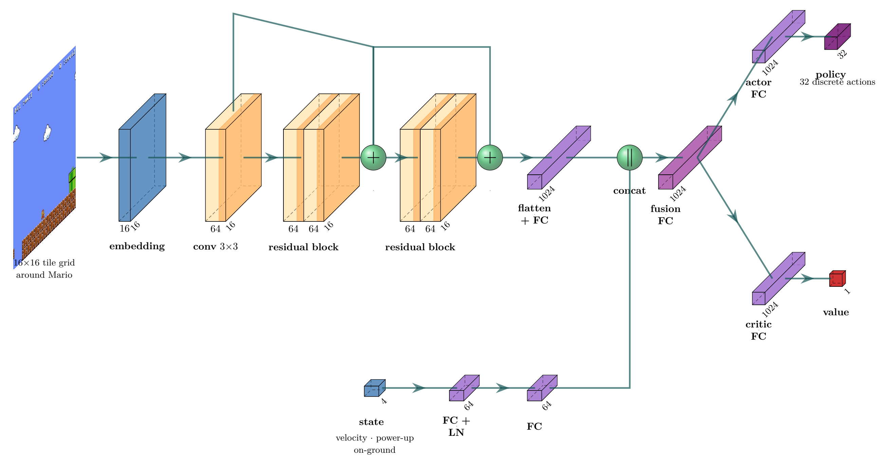
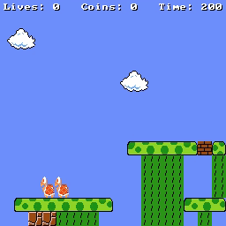
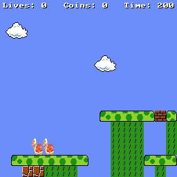

# Stack More Levels: General and Human-like Mario Playing

This is the official repository for **"Stack more levels: how to get general and human-like Mario playing"** (Shinichi Arimura, Yuchen Li, Julian Togelius — IEEE CoG 2026).

If you use this work for research, please consider citing our paper as follows:
```
@inproceedings{arimura2026stack,
  title     = {Stack more levels: how to get general and human-like Mario playing},
  author    = {Arimura, Shinichi and Li, Yuchen and Togelius, Julian},
  booktitle = {IEEE Conference on Games (CoG)},
  year      = {2026}
}
```



We train model-free PPO agents on PCG-generated Mario levels, shape them into three playstyle **personas** (runner, killer, collector) with segment-based rewards, then fine-tune with **DRAIL** on human demonstrations. All agents share one residual-CNN encoder over a 16×16 tile grid plus velocity, power-up, and on-ground state, with separate actor and critic heads over 32 discrete actions.

The following instructions reproduce the main experiments in the paper.


## Segment-Based Playstyle Rewards

Dense progress rewards push the agent rightward and compete with sparse kill/collect bonuses. We reward **16-tile segment checkpoints** and a shared win bonus instead; persona bonuses apply within each segment so runner, killer, and collector can diverge without a constant rightward gradient.


## General Mario Playing

We train on four fixed pools of distinct PCG levels ($N \in \{100, 1\text{k}, 10\text{k}, 50\text{k}\}$) and evaluate on **1,000 held-out test levels** (filtered to $>10$ coins and $>10$ enemies). PPO uses a **one-life, best-of-10** protocol: a level counts as won if any of 10 stochastic rollouts reaches the goal.

Each tenfold increase in training levels multiplies win odds by **3.70×** (runner), **2.83×** (killer), and **4.34×** (collector). Collector scales most strongly to **85.5%** win at 50k; killer peaks at **82.3%** (10k) before dropping to 68.0% (50k).

### PPO performance of different playstyle on 1000 held-out levels

One-life, **best-of-10** rollouts per level (stochastic policy). Reported values are means over the 1,000 test levels; per level we take the **best** outcome across the 10 attempts:

- **Win** — fraction of levels where at least one rollout reaches the goal
- **Compl.** — best completion percentage across the 10 rollouts
- **Kill** — best kill ratio (enemies killed ÷ enemies in the level; can exceed 1 if enemies respawn)
- **Coin** — best coin ratio (coins collected ÷ coins in the level)

| Agent | Levels | Win | Compl. | Kill | Coin |
|:------|-------:|----:|-------:|-----:|-----:|
| Runner | 100 | 0.091 | 0.415 | 0.092 | 0.125 |
| | 1k | 0.462 | 0.709 | 0.135 | 0.238 |
| | 10k | 0.630 | 0.806 | 0.142 | 0.248 |
| | 50k | **0.648** | **0.817** | 0.151 | 0.253 |
| Killer | 100 | 0.222 | 0.561 | 0.384 | 0.158 |
| | 1k | 0.540 | 0.776 | 0.638 | 0.221 |
| | 10k | **0.823** | **0.926** | **0.846** | 0.307 |
| | 50k | 0.680 | 0.832 | 0.747 | 0.247 |
| Collector | 100 | 0.202 | 0.549 | 0.174 | 0.382 |
| | 1k | 0.535 | 0.786 | 0.267 | 0.653 |
| | 10k | 0.751 | 0.888 | 0.326 | 0.804 |
| | 50k | **0.855** | **0.929** | 0.321 | **0.845** |

| Runner | Killer | Collector |
|:------:|:------:|:---------:|
|  |  |  |

*PPO personas trained on 50k levels (showcase rollouts).*


## Human-like Mario Playing

We fine-tune with **DRAIL** on style-filtered human demonstrations (50 trajectories per archetype) and evaluate with **five lives** to match the collection protocol. **PPO → DRAIL** adds a diffusion-discriminator imitation term on top of the persona reward ($\lambda = 1.2$ / 2.9 / 2.5 for runner / killer / collector).

### DRAIL performance of different methods on 1000 held-out levels

Five-life rollouts on the **1,000 held-out test levels**; human-likeness is scored on **95 held-out human trajectories**. Reported values are means over the respective evaluation sets:

- **Avg. AAR** — fraction of human states where the agent's action matches the recorded human action (higher = more human-like)
- **Avg. Action JS** — Jensen–Shannon divergence between agent and human action distributions (lower = more human-like)
- **Collector coin ratio** — coins collected ÷ coins in the level on held-out rollouts (persona preservation)

| Method | Avg. AAR ↑ | Avg. Action JS ↓ | Collector coin ratio |
|:-------|----------:|-----------------:|---------------------:|
| PPO | 0.015 | 0.643 | **0.927** |
| Direct DRAIL | **0.397** | **0.103** | 0.565 |
| PPO → DRAIL | 0.324 | 0.218 | 0.915 |

| Direct DRAIL | PPO → DRAIL |
|:------------:|:-----------:|
|  |  |

*Collector persona: direct DRAIL vs. PPO → DRAIL (five-life showcase rollouts).*


## Prerequisites

- Python ≥ 3.10
- CUDA build of PyTorch
- JDK on `PATH` (Java Mario simulator via JPype)

### Install

```bash
pip install -e .              # from this directory
# or: pip install -e main/    # from the repository root
```

Levels, human demonstrations, and published checkpoints live in the repository root (`../data/`, `../human_like_rl/checkpoints/`). Simulator jars and sprites are vendored in `smb/`.


## Train PPO Personas

Paper presets are in [`configs/`](configs/). Load with `--config`; CLI flags override individual fields.

```bash
python -m src.training.train_ppo --config runner.yaml
python -m src.training.train_ppo --config killer.yaml
python -m src.training.train_ppo --config collector.yaml
```

| Parameter | Flag | Description | Preset |
| :--- | :--- | :--- | :--- |
| **Config** | `--config` | YAML preset | `runner` / `killer` / `collector` |
| **Level pool** | `--level-dir` | PCG training levels | `playable_train_50000` |
| **Seed** | `--seed` | Run seed | 9 / 7 / 4 |
| **Timesteps** | `--total-timesteps` | Training budget | `500000000` |
| **Segment / win** | `--segment-reward`, `--win-reward` | Base competence | `1.0` / `5.0` |
| **Persona bonus** | `--kill-reward`, `--coin-reward`, … | Style shaping | 0 or `2.5` |

Checkpoints: `mario_ppo_step_<N>.pt`, `mario_ppo.pt`, `mario_ppo_args.json` under `runs/`.


## Train DRAIL

```bash
# Direct DRAIL (discriminator reward only)
python -m src.training.train_drail --config drail_direct_collector.yaml

# PPO → DRAIL post-training (persona reward + λ · DRAIL)
python -m src.training.train_drail --config drail_posttrain_runner.yaml
python -m src.training.train_drail --config drail_posttrain_killer.yaml
python -m src.training.train_drail --config drail_posttrain_collector.yaml
```

| Parameter | Flag | Description | Preset (post-train) |
| :--- | :--- | :--- | :--- |
| **Config** | `--config` | YAML preset | persona-specific |
| **Init checkpoint** | `--init-from` | Pretrained PPO bundle | `../human_like_rl/checkpoints/ppo/<role>` |
| **DRAIL weight** | `--drail-lambda` | Imitation mixing λ | 1.2 / **2.9** / **2.5** |
| **Expert data** | `--action-state-dir` | Style-filtered `.npz` trajectories | persona-specific |
| **Lives** | `--lives` | Rollout protocol | `5` |

Also saves `drail_discriminator.pt` beside the policy checkpoint.


## Evaluation

```bash
# Competence (one-life, best-of-10) → evaluation_results_*.json
python -m src.evaluation.evaluate --model-path <ckpt> --level-dir ../data/human_experiment/levels/test_1000

# Human-likeness: AAR + Action JS on 95 held-out human trajectories
python -m src.evaluation.aar ../human_like_rl/checkpoints/ppo --output-json aar_results.json

# Showcase videos (best-of-10 rollouts)
python -m src.evaluation.record_videos
```

| Script | Metric / output |
| :--- | :--- |
| `src.evaluation.evaluate` | Win rate, completion, kill/coin ratios |
| `src.evaluation.aar` | AAR and Action JS vs. held-out human play |
| `src.evaluation.record_videos` | MP4s + manifest under `../results/showcase_videos/` |

Published checkpoints under `../human_like_rl/checkpoints/` (`ppo/`, `drail/`, `ppo_to_drail/`) load without modification.


## Repository Layout

```
configs/     YAML experiment presets (personas + DRAIL)
assets/     figures and showcase GIFs
src/         env · models · data · training · evaluation
smb/         Mario-AI-Interface jar and sprites
```

Legacy scripts remain in [`../human_like_rl/`](../human_like_rl/); non-paper material is in [`../archive/`](../archive/).
